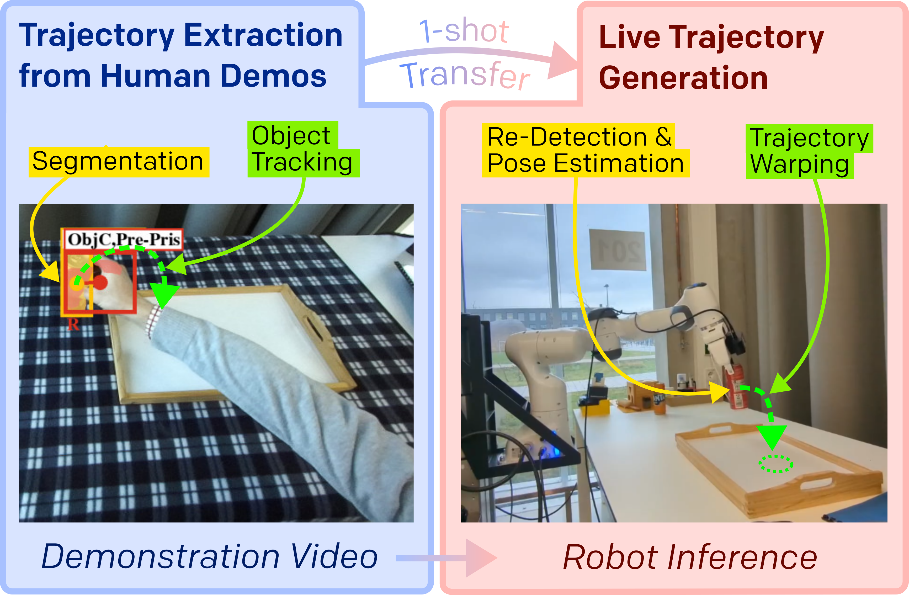

# DITTO: Demonstration Imitation by Trajectory Transformation
[**arXiv**](https://arxiv.org/abs/2403.15203) | [**website**](http://ditto.cs.uni-freiburg.de) 

Repository providing the source code for the paper
> DITTO: Demonstration Imitation by Trajectory Transformation  
> [Nick Heppert](https://rl.uni-freiburg.de/people/heppert), [Max Argus](https://lmb.informatik.uni-freiburg.de/people/argusm),  [Tim Welschehold](https://rl.uni-freiburg.de/people/welschehold), [Thomas Brox](https://lmb.informatik.uni-freiburg.de/people/brox) and [Abhinav Valada](https://rl.uni-freiburg.de/people/valada)

<p align="center">
  <!--  -->
  
</p>


## Installation 🏗
We recommend to use conda.

```[bash]
# conda create -n DITTO python=3.8 # for a ROS-compatible environment
conda create -n DITTO python=3.10 # future proof
conda activate DITTO
```

Install torch as your liking/your CUDA version e.g.
```[bash]
pip3 install torch torchvision torchaudio --index-url https://download.pytorch.org/whl/cu117
```

```[bash]
pip install -r requirements.txt
conda install -c conda-forge libstdcxx-ng
pip install -e .
```

### Install FlowControl (optional)
Frist clone the fork of the repo
```[bash]
git clone git@github.com:SuperN1ck/flowcontrol.git
```

follow the instructions in the readme, i.e.

```
pip install -e .
```

and installing RAFT as described [here](https://github.com/SuperN1ck/flowcontrol/tree/RAFT_package?tab=readme-ov-file#installing-raft-recommended)

## Data 🗄️

Download the all files from [here](http://ditto.cs.uni-freiburg.de/download/demonstration_data.tar.gz) and extract them
```
tar -xzvf demonstration_data.tar.gz
```
at a location to your liking. As defined in [config.py](DITTO/config.py#17), per default DITTO assumes demonstrations located under the project root under `demonstrations/`.

If correctly extrated you should see a file structure like

```
demonstrations/
    recordings_24_01_04/
        coke_tray/
            000/
                cnos_redetected_masks/  # We used CNOS to redect all masks given the initial frame.
                    object_seg_000.png
                    ...
                confidence/             # Confidence arrays
                    00000.npy
                    ...
                depth/                  # Depth arrays
                    00000.npy
                    ...
                hands23/                # Output of hands23, see their repo (link below)
                    left_hand/
                    right_hand/
                    00000.png
                    ...
                rgb/                    # RGB arrays
                    00000.png
                    ...
                sam_refined/            
                    # Refined masks using our procedure described in the appendix.
                    # Provides a container segmentation or object segmentation for the timestep in the name.
                    # Not for every timestep.
                    [container_seg_000.png] 
                    [object_seg_000.png]
                    ...
                config.yaml            # Zed2 Camera Configuration
                images.np.npz           # All images compressed into a single archive for faster loading
                intrinsics.yaml         # The instrinsics of the used camera
                time_steps.yaml         # See down low for a thorough explanation
                zed2.svo                # Raw Zed2 recordings
            001/
            ...
        ...
    recordings_25_01_05/
        ...
```

For an overview of the Hands23 format see [their Github Page](https://github.com/EvaCheng-cty/hands23_detector?tab=readme-ov-file#results).

## Running 🏃🏼

All scripts are powered by [tyro](www.github.com/brentyi/tyro), an awesome CLI wrapper, thus, you can simply append `--help` and will get an overview of all parameters.

### Video Segmentation Pipeline 📹

*The scripts have been run in a while and could be potentially be broken/out of sync with their respective. We provide pre-processed masks in our data already. If you have any issues and/or suggestions, happy for any issue/PR!*

#### Using Hands23
To extract labels use
```[bash]
python scripts/process_with_hands23.py
```

To then automatically annotate timesteps based on the hand state use
```[bash]
python scripts/auto_annotate_timesteps.py
```

#### Updating Hands23 Masks
We provide two methods to improve object and goal segmentation masks. First, we use CNOS to re-detect objects
```[bash]
python scripts/redetect_with_cnos.py
```

And second, we use SAM and spatial distances
```[bash]
python scripts/refine_with_sam.py
```

We found the latter to perform consistently better.


### Notebook for Utility Overview 🪛

We provide a notebook under `notebooks/DITTO_example_usage.ipynb` that showcases how to use DITTO.


### Paper Evaluation 📓
To run the same evaluations as in the paper use the following commands.

#### Table I (a) - Correspondences within one Episode
```[bash]
python scripts/eval/track_correspondences_within_episode.py
```

#### Table I (b) - Correspondences between Episodes
```[bash]
python scripts/eval/track_correspondences_between_episode.py
```

#### Table II - Relative Poses between Episodes
```[bash]
python scripts/eval/evaluate_relative_poses_between_trajectories.py
```

#### Result Plotting
The previous mentioned scripts will produce result files. For investigating the results we provide two notebooks under

```
notebooks/
    eval/
        correspondences.ipynb
        poses.ipynb
```

### 3D Renderings
We also provide a notebook to render rotating 3D scenes under `notebooks/show_single_trajectory.ipynb`.

### `time_steps.yaml` ⏱️

For each demonstration there is a `time_steps.yaml`-file. It contains manual adjustements if needed.
```
# Automatically extracted from scripts/auto_annotate_timesteps.py
 - t_start: 13
 - t_stop: 44
# Use the CNOS-based re-dection mask over Hands23 ones (CNOS is very unlikely to be better due to occlusions)
 - cnos_over_hands23: [17, ...] 
# In case none of our methods produced a good segmentation mask, we will shift a timestep back/forward
 - redirect_to_other_step: {21: 22, ...}
# Overwrites the start of the episode
 - t_h23_object_manual: 11
# Overwrites the stop of the episode
 - t_stop_manual: 35
```

## Publication 📝

If you find this repository useful, please consider citing the paper as follows ✍🏼:
```[bibtex]
@inproceedings{heppert2024ditto,
  title={DITTO: Demonstration Imitation by Trajectory Transformation},
  author={Nick Heppert, Max Argus, Tim Welschehold, Thomas Brox, Abhinav Valada},
  booktitle={2024 IEEE/RSJ International Conference on Intelligent Robots and Systems (IROS)},
  year={2024},
  organization={IEEE}
}
```

Also checkout our [utility library casino](https://github.com/SuperN1ck/casino).

### Additions/Changes from the accepted paper 🔀

#### Demonstration Splitting
Please note that different from the paper, we split the `tennisball_cup` into two seperate tasks. 

Original, for the numbers in the paper, they were all merged under one
```
tennisball_cup/
    000/
    001/
    002/
    003/
    004/
```
In this repository, as defined in `config/valid_episodes.yaml`, we assume a split into
```
tennisball_cup_laying/
    000/
    001/
    002/
tennisball_cup_upright/
    003/
    004/
```

#### Updated Metrics
Vilja Lott also developed an updated metric for calculating the relative pose error. We will release the results soon.
<!-- Please find update, more accurate results below -->

## 🤝 Acknowledgements
This work was partially funded by the Carl Zeiss Foundation with the ReScaLe project.
